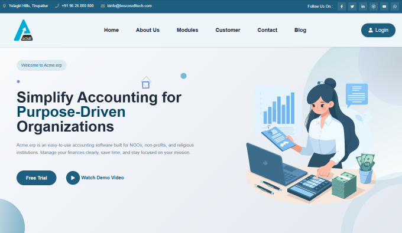
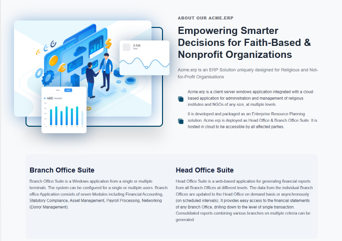
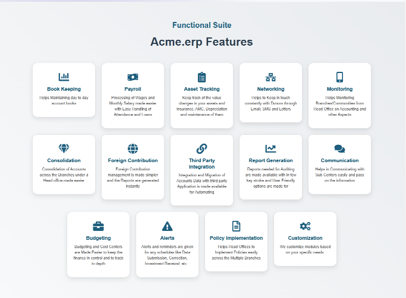
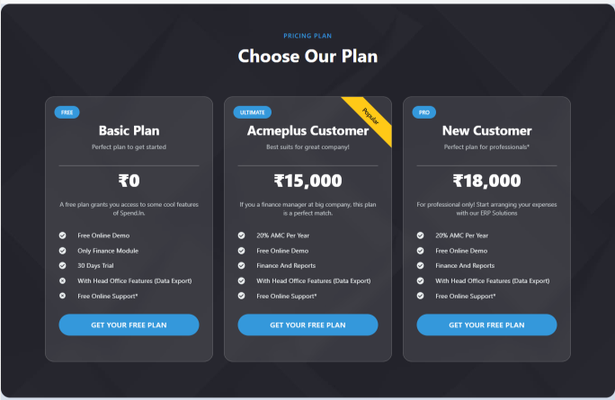

# Acmeerpweb

Acmeerpweb is a modern web application project designed to provide ERP (Enterprise Resource Planning) solutions with a focus on usability, performance, and scalability. The project leverages React and Vite for the frontend, along with a variety of open-source libraries for data visualization, UI, and more.

## Features
- Modern, responsive UI built with React and Vite
- Interactive dashboards with map visualizations (India/world)
- Client and branch analytics
- Modular component-based architecture
- Contact form with email integration
- Toast notifications for user feedback
- Smooth animations and transitions
- Routing for multiple pages (Accounting, Finance, Terms, Privacy, etc.)
- Extensive use of SVG and vector assets

## Folder Structure

```
acme_erp/
├── src/
│   ├── assets/
│   │   ├── about_13_2.jpg, about_13_3.jpg, aboutus.jpg, ...
│   │   └── img/
│   │       ├── bg/         # Background images
│   │       ├── blog/       # Blog images
│   │       ├── client/     # Client logos/images
│   │       ├── hero/       # Hero section images
│   │       ├── icon/       # Icon images
│   │       ├── normal/     # Misc images
│   │       ├── shape/      # Shape images
│   │       └── testimonial/# Testimonial images
│   ├── components/         # React components (Header, Footer, MapDashboard, etc.)
│   ├── css/                # CSS files for each component/page
│   ├── page/               # Page-level React components (Accounting, Finance, etc.)
│   ├── App.jsx             # Main App component
│   ├── main.jsx            # Entry point
│   └── index.css           # Global styles
├── React/
│   ├── assets/             # Additional static assets
│   ├── index.html          # HTML template
│   └── 404.html            # Custom 404 page
├── package.json            # Project dependencies and scripts
├── package-lock.json       # Dependency lock file
├── vite.config.js          # Vite configuration
├── eslint.config.js        # ESLint configuration
└── index.html              # Main HTML file
```

## Screenshots

Below are some screenshots of the application UI:






## Packages Used

For a full list of packages and their descriptions, please see [`acme_erp/package.json`](./acme_erp/package.json).

### Notable Packages
- **react-simple-maps**: Used for rendering interactive SVG maps (India/world) in the dashboard and analytics sections. It enables easy map visualization and region highlighting.
- **d3**: For advanced data-driven visualizations and map path data.
- **framer-motion**: For smooth animations and transitions in UI components.
- **react-router-dom**: For client-side routing between pages.
- **react-icons**: For scalable vector icons.
- **react-toastify**: For toast notifications.
- **emailjs-com**: For sending emails from contact forms.

## Getting Started

1. Navigate to the `acme_erp` directory:
   ```sh
   cd acme_erp
   ```
2. Install all dependencies (including react-simple-maps):
   ```sh
   npm install --legacy-peer-deps
   ```
   > If you only need to install react-simple-maps separately, use:
   > ```sh
   > npm install react-simple-maps --legacy-peer-deps
   > ```
3. Start the development server:
   ```sh
   npm run dev
   ```

## Usage Example: react-simple-maps

The `react-simple-maps` package is used in components like `MapDashboard.jsx` and `MapIndia.jsx` to render interactive SVG maps. These maps display client presence and allow users to interact with different regions for analytics and visualization.

## Contributing

Contributions are welcome! To contribute:
- Fork the repository
- Create a new branch for your feature or bugfix
- Make your changes and commit them with clear messages
- Open a pull request describing your changes

## Contact

For questions, support, or business inquiries:
- Email: binfo@boscosofttech.com
- Phone: +91 96 26 800 800

## License

This project is licensed. See individual files for license information or contact the project maintainer for details.